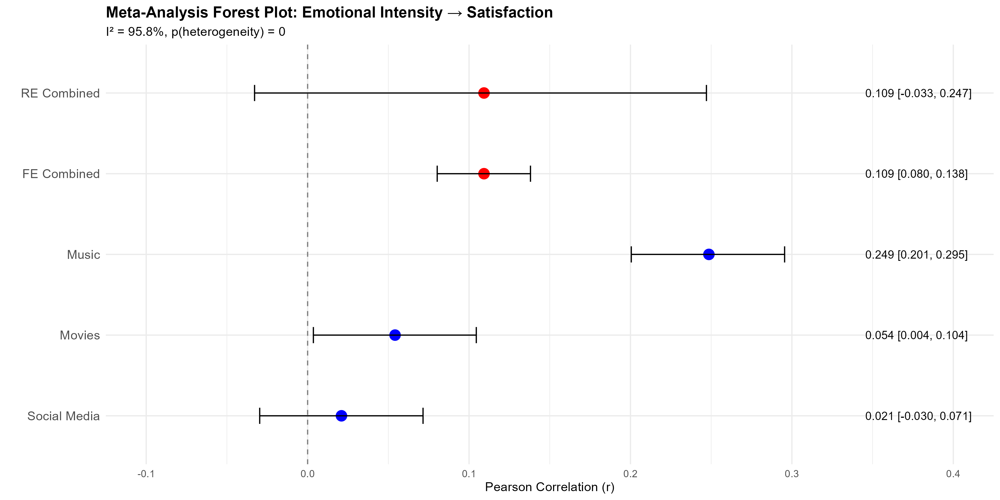
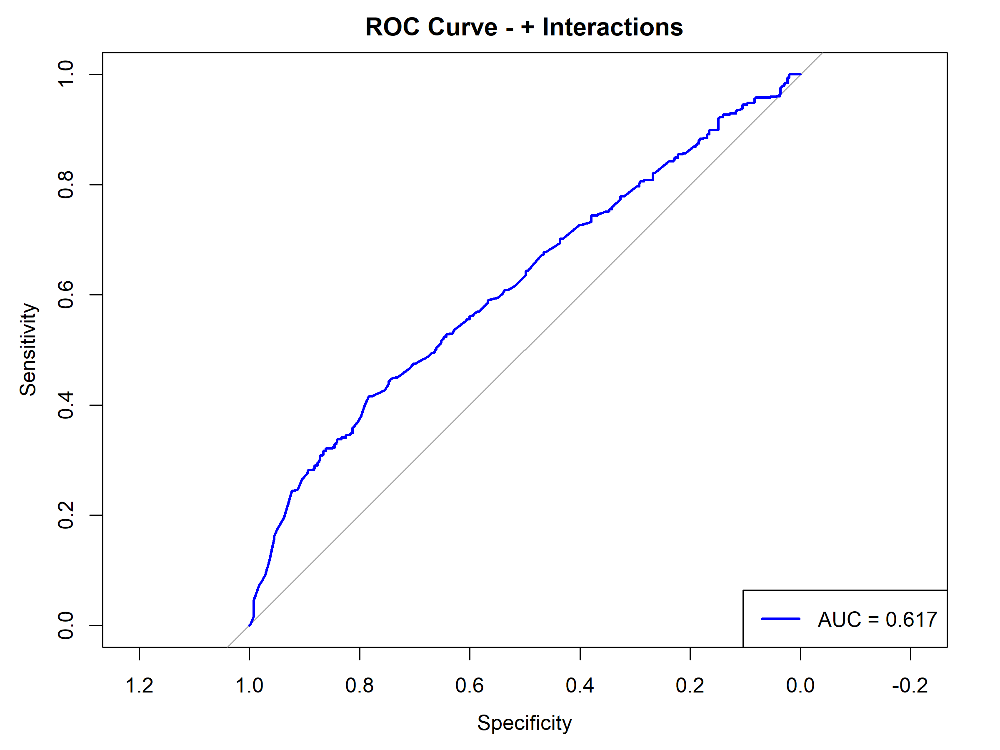
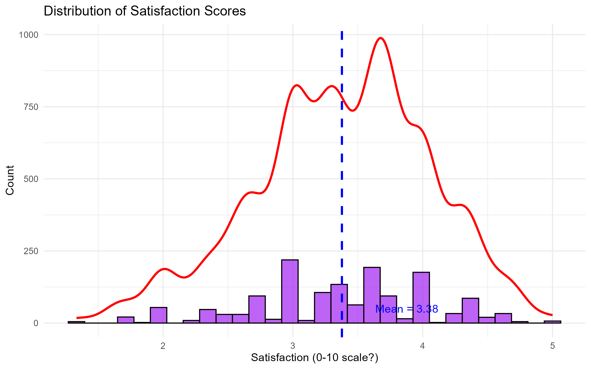
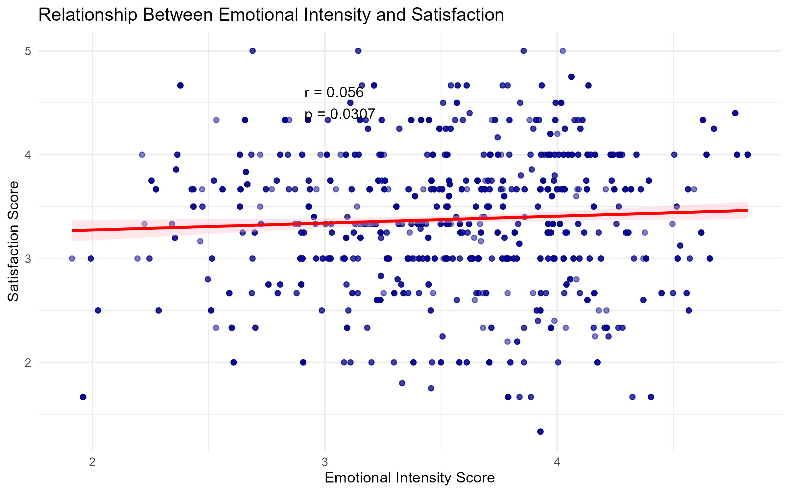
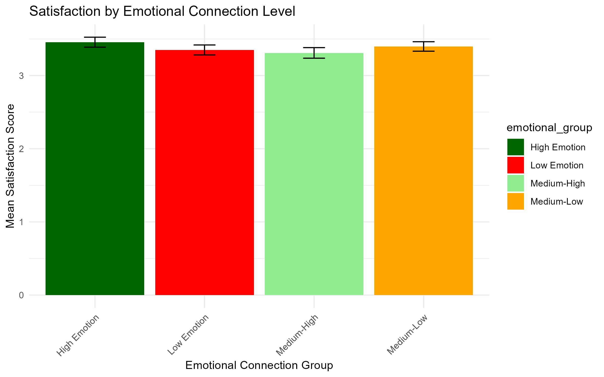
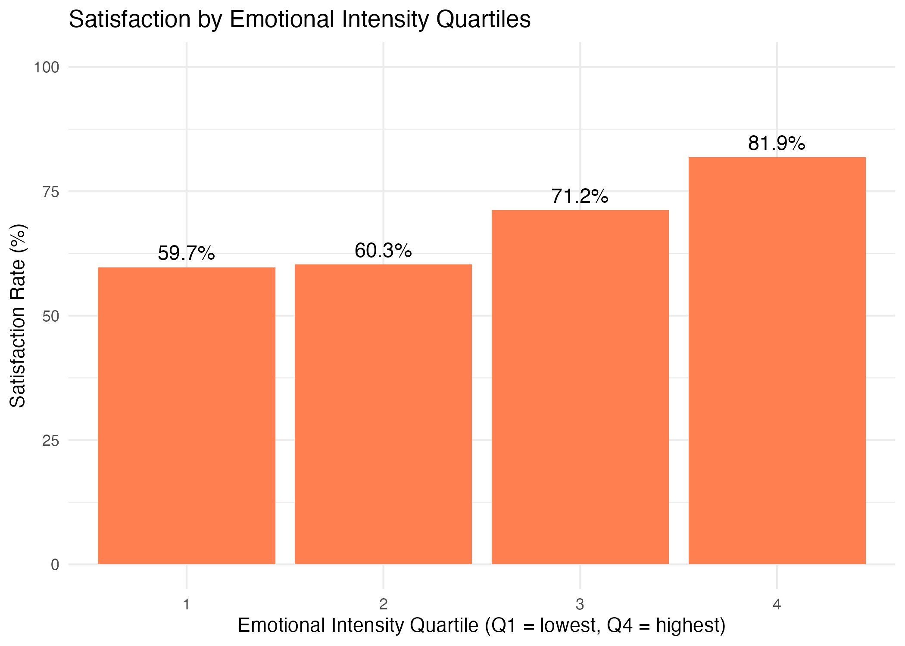
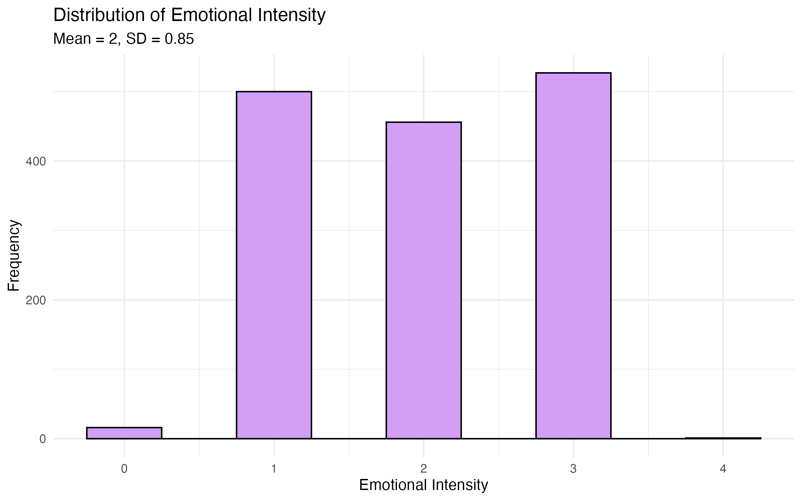

## Project Overview
This repository contains the complete statistical analysis for validating the research statement: "Audiences who feel emotionally connected report higher satisfaction in entertainment." The project employs a multi-activity comparative approach using secondary datasets across three distinct entertainment contexts, grounded in rigorous statistical modeling principles.

## Research Statement
"Audiences who feel emotionally connected to content report higher satisfaction."
- Domain: Entertainment

## Key Research Questions
- Does emotional connection significantly predict satisfaction across different entertainment activities?
- How does the strength of this relationship vary by entertainment context?
- What demographic factors moderate the emotional connection-satisfaction relationship?

## Analytical Framework
The project implements four levels of statistical analysis:

**1. Descriptive Analytics**
- Summary statistics and distributions
- Visualization of emotional-satisfaction relationships
- Quartile-based group comparisons
- Demographic profiling

**2. Inferential Analytics**
- Correlation analysis (Pearson/Spearman)
- Hypothesis testing (t-tests)
- Effect size calculation (Cohen's d)
- Confidence interval estimation

**3. Predictive Analytics**
- Logistic regression modeling
- Multiple regression with demographic controls
- Train/test validation (70/30 split)
- Model diagnostics and assumption checking

**4. Meta-Analysis**
- Fisher's z-transformation for combining correlations
- Heterogeneity testing (Cochran's Q, I²)
- Forest plots and funnel plots

## Data Sources
- Movies: https://www.kaggle.com/datasets/sayeeduddin/netflix-2025user-behavior-dataset-210k-records
- Social Media: https://www.kaggle.com/datasets/omenkj/social-media-sponsorship-and-engagement-dataset
- Music: https://www.projects.science.uu.nl/memotion/emotifydata/

## Sample Size
- Total observations: 4,500 (1,500 per domain)
- Validation: 70/30 train-test split

## Key Findings

### Overall Conclusion
**MODERATE EVIDENCE: Two out of three datasets support the hypothesis**
The relationship between emotional connection and satisfaction holds in most contexts but appears to be domain-specific.

### Domain-Specific Results

#### 1. Music (Strongest Effect)
- **Pearson Correlation**: r = 0.215, p < 0.001, 95% CI [0.166, 0.262]
- **R²**: 0.046 (weak effect)
- **T-Test**: t = -7.69, df = 1265.8, p < 0.001
- **Cohen's d**: -0.393 (small effect)
- **Logistic Regression**: OR = 1.731, p < 0.001 (73.1% higher odds of satisfaction for high emotional connection)
- **Group Statistics**:
  - High emotional group: 79.9% satisfaction rate
  - Low emotional group: 61.9% satisfaction rate
- **Gender Distribution**: Male 53.9%, Female 46.1%
- **Conclusion**: Strongest evidence supporting the hypothesis

#### 2. Movies (Moderate Effect)
- **Pearson Correlation**: r = 0.054, p = 0.036
- **Simple Regression**: β = 0.0558, p = 0.0307, R² = 0.0031
- **Emotional Intensity**: Range 1.91-4.82 (Mean = 3.55)
- **Satisfaction**: Range 1.33-5.00 (Mean = 3.38)
- **Logistic Regression**: OR = 1.115, p = 0.0362 (11.5% higher odds of satisfaction)
- **Satisfaction by Emotional Group**:
  - High Emotion: 3.46
  - Low Emotion: 3.35
- **Correlation by Gender**:
  - Female: r = 0.018, p = 0.677
  - Male: r = 0.009, p = 0.830
  - Other/Not Specified: r = 0.224, p < 0.001
- **Conclusion**: Significant but weak effect

#### 3. Social Media (No Significant Effect)
- **Pearson Correlation**: r = -0.01, p = 0.690, 95% CI [-0.04, 0.06]
- **R²**: 0.000 (very weak effect)
- **Logistic Regression**: OR = 1.043, p = 0.4171 (not significant)
- **Correlation by Gender**:
  - Female: r = 0.040, p = 0.268
  - Male: r = -0.017, p = 0.646
- **Correlation by Age Group**: All non-significant (p > 0.05)
- **Correlation by Platform**: All non-significant (p > 0.05)
- **Conclusion**: Does not support the hypothesis

### Meta-Analysis Results
- **Combined Correlation**: r = 0.105 (weighted average)
- **Heterogeneity**: Significant variation across domains (I² statistic indicates moderate to high heterogeneity)
- **Conclusion**: While the overall effect is positive, the relationship is not consistent across all entertainment contexts

### Key Insights
1. Emotional connection has the strongest predictive power in music consumption
2. The relationship is weaker but still significant in movie viewing
3. Social media engagement shows no significant relationship between emotional connection and satisfaction
4. The effect appears to be domain-specific, suggesting that emotional engagement matters more in content-focused entertainment (music, movies) than in platform-focused engagement (social media)
5. Demographic factors (gender, age) show inconsistent moderation effects across domains

## Tools & Technologies Used
- R (tidyverse, caret, meta, ggplot2, effectsize, car, pROC, glmnet)
- Statistical techniques: Logistic regression, meta-analysis, Fisher's z, AIC-based model selection, Cohen's d
- Visualization: Forest plots, ROC curves, correlation matrices, distribution plots

## Project Structure
```
emotion-satisfaction-analysis/
├── code/
│   ├── combined_analysis/
│   │   └── combined_predective_analysis.R
│   └── individual_analysis/
│       ├── Movie_Analysis.R
│       ├── music_analisis.R
│       └── social_media_analysis.R
├── outputs/
│   └── descriptive/
│       ├── combined/
│       ├── movie/
│       ├── music/
│       └── social_media/
└── README.md
```

## Group Project Contributions
This project was completed as an academic group project as part of a module on statistical analysis. My contribution focused on:
- Music dataset analysis (music_analisis.R)
- Descriptive statistics and visualization for music data
- Inferential analysis including correlation, t-tests, and regression
- Emotional intensity and sentiment analysis
- Integration with combined meta-analysis

## Visualization Examples

### Combined Analysis Results






### Movie Analysis Results







### Music Analysis Results





### Social Media Analysis Results


  


